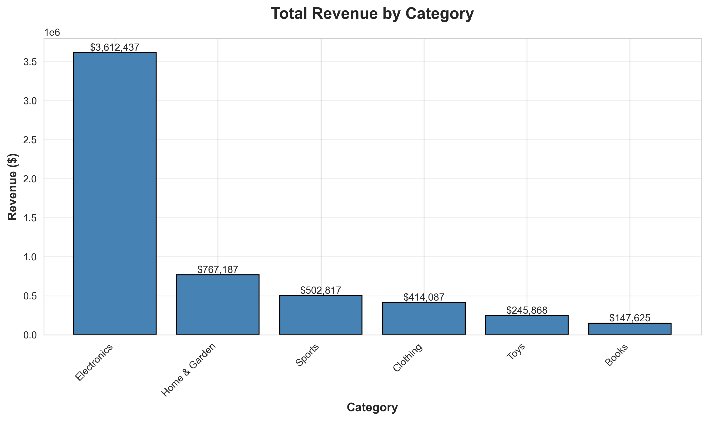
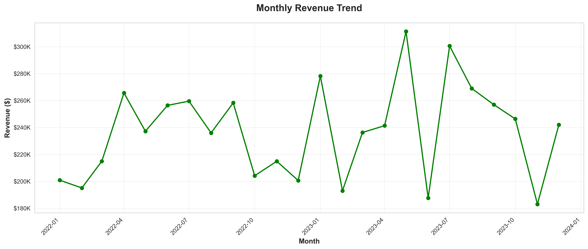
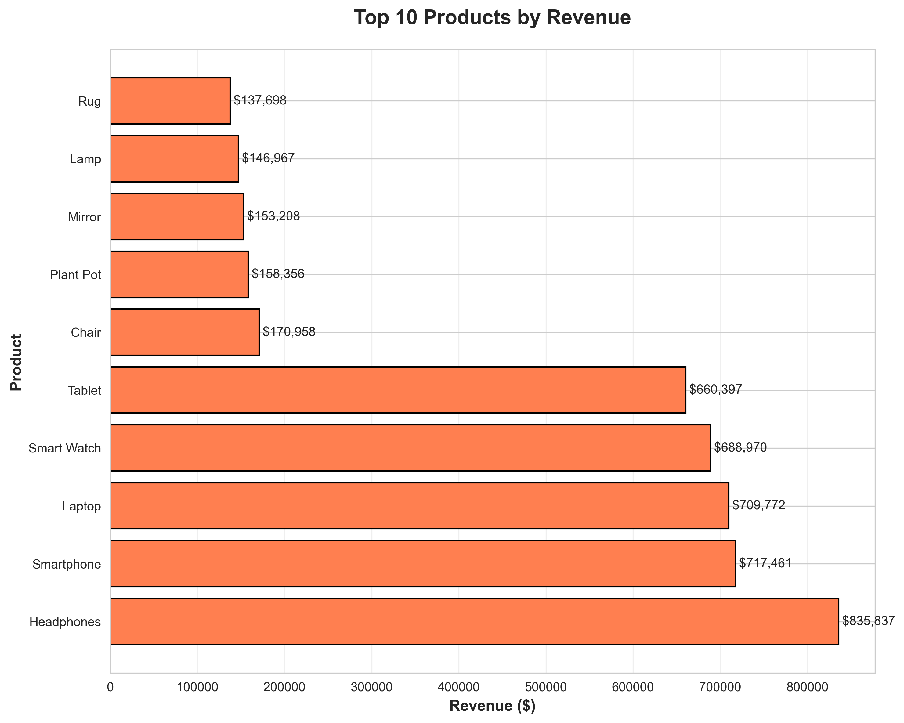

# 📊 E-Commerce Sales Analysis Project


## 🎯 Project Overview

End-to-end data analysis project analyzing **5,000+ e-commerce transactions** across 2 years (2022-2023) to identify sales trends, top-performing products, and regional insights for strategic business decisions.

## 🔗 Live Interactive Dashboard

**[View Tableau Public Dashboard →]
((https://public.tableau.com/app/profile/shadab.samad/vizzes))**


---

## 📁 Project Structure
```
├── ecommerce_sales_data.csv          # Original dataset
├── ecommerce_sales_cleaned.csv       # Cleaned data
├── tableau_data.csv                  # Tableau-ready data
├── analysis_report.txt               # Detailed findings & recommendations
├── revenue_by_category.png           # Visualization 1
├── revenue_by_region.png             # Visualization 2
├── monthly_trend.png                 # Visualization 3
├── top_products.png                  # Visualization 4
└── README.md                         # Project documentation
```

---

## 🛠️ Tools & Technologies

- **Python 3.x** - Data manipulation and analysis
  - Pandas - Data cleaning and transformation
  - NumPy - Numerical computations
  - Matplotlib/Seaborn - Data visualization
- **Tableau Public** - Interactive dashboard creation
- **Jupyter Notebook / PyCharm** - Development environment
- **Git/GitHub** - Version control and portfolio hosting

---

## 📊 Key Insights

### Revenue Performance
- **Total Revenue:** $5.69M across all categories
- **Average Order Value:** Calculated and tracked monthly
- **Top Category:** Electronics - $3.61M (63.4% of total revenue)

### Regional Analysis
- **South Region:** Highest performer with $1.50M
- **North Region:** Strong second with $1.39M
- Regional distribution relatively balanced

### Product Performance
- **Top Product:** Headphones - $835,837 in revenue
- **Top 10 Products** identified for inventory prioritization
- Clear product winners across categories

### Trends
- Monthly revenue fluctuates between $180K - $310K
- Average monthly revenue: $237,084
- Seasonal patterns identified for forecasting

---

## 🔍 Analysis Process

### 1. Data Collection & Generation
- Created realistic e-commerce dataset
- 5,000 transactions across 6 product categories
- 4 geographic regions, multiple products per category

### 2. Data Cleaning
```python
- Handled missing values (2% missing customer IDs)
- Converted date formats for time-series analysis
- Created derived columns (Year, Month, Quarter, Day of Week)
- Validated data integrity and consistency
```

### 3. Exploratory Data Analysis
- Revenue aggregation by category, region, product
- Time-series trend analysis
- Statistical summary metrics
- Identified top performers and patterns

### 4. Visualization
Created 4 core visualizations:
- Bar chart: Revenue by Category
- Pie chart: Regional Revenue Distribution  
- Line chart: Monthly Revenue Trend
- Horizontal bar chart: Top 10 Products

### 5. Dashboard Development
- Designed interactive Tableau dashboard
- Implemented category and region filters
- Created cohesive 2x2 layout
- Added professional formatting and labels

---

## 📈 Visualizations

### Revenue by Category


### Regional Performance


### Monthly Trend


### Top Products


---

## 💡 Business Recommendations

1. **Focus on Electronics:** Invest more in electronics inventory and marketing (63% of revenue)
2. **Regional Strategy:** Expand operations in South region, investigate North region's strong performance
3. **Product Prioritization:** Ensure Headphones, Smartphones, and Laptops are always in stock
4. **Seasonal Planning:** Prepare for high-demand months (April-May) identified in trends
5. **Category Optimization:** Investigate why Books and Toys underperform; consider promotions

---

## 🚀 Skills Demonstrated

- ✅ Data Cleaning & Preparation
- ✅ Exploratory Data Analysis (EDA)
- ✅ Statistical Analysis
- ✅ Data Visualization
- ✅ Dashboard Design & Development
- ✅ Business Intelligence & Insights
- ✅ Data Storytelling
- ✅ Python Programming
- ✅ Tableau Proficiency
- ✅ Technical Documentation

---

## 📝 How to Run This Project

### Prerequisites
```bash
pip install pandas numpy matplotlib seaborn
```

### Steps
1. Clone this repository
2. Open the Python files in Jupyter Notebook or PyCharm
3. Run the data generation and analysis scripts
4. View visualizations or open Tableau workbook
5. Read analysis_report.txt for detailed findings

---

## 📧 Contact

**[Shadab Samad]**
- 📧 Email: shadabx8x@gmail.com
- 📊 Tableau Public: (https://public.tableau.com/app/profile/shadab.samad/vizzes)
- 💼 LinkedIn:(https://www.linkedin.com/in/shadab-samad-821a00269/)

---

## 📄 License

This project is open source and available for educational purposes.

---

**⭐ If you found this project helpful, please give it a star!**
```
